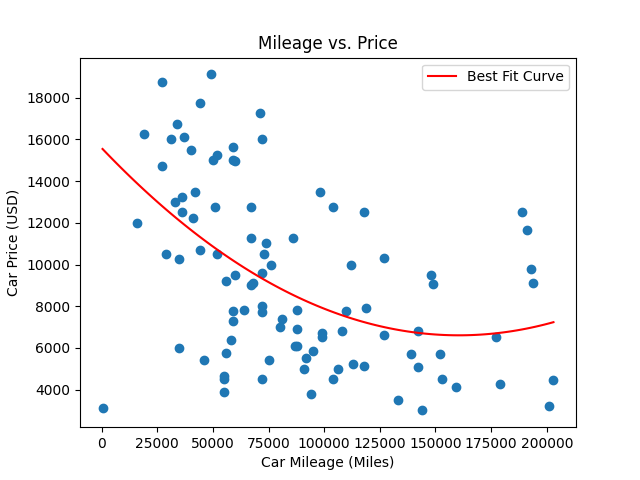

# BAT-Price-Estimator

Uses Bring A Trailer auction data to estimate a "fair" (BAT prices are usually a bit over market price) price for a certain model based on mileage. Does take a while to load all the listings since it uses Playwright to scrape data. Cleans most of the outliers to get a more accurate price using IQR. Returns a fair price range in terminal and shows a graph incase you wanted to look at the correlation.

Hoping to carry this into a "deal finder" of some sort comparing to the price to an expected price but kind of hard to do with auctions. 

Feel free to mess around with it and let me know if you have any issues I will try to fix as soon as I can. 

BAT is kind of weird were if you search for a model say 300e, it will take you to an entirely different page than if you search a body like w124 so I'm actively trying to make sure that both work as intended. Also I will probably try to change the calculation method since it makes no sense for the graph to act like a polynomial and raise in price after some point. 

Here is an example of it running for a Mercedes 300e with 50,000 miles:

